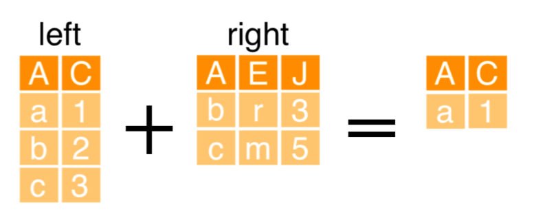

# Wrangling Text

Since text is unstructured data, a certain amount of wrangling is required to get it into a form where you can analyze it. In this chapter, you will learn how to add structure to text by tokenizing, cleaning, and treating text as categorical data.

```{r, include=FALSE}
twitter_data <- readRDS("data/ch_1_twitter_data.rds")
```

## Text as data

__Using the tidyverse__

- dplyr
- ggplot2

```{r, out.width="20%", echo = FALSE, fig.align='default'}

knitr::include_graphics("img/ggplot2.png")
knitr::include_graphics("img/tidyverse.png")
```

__Loading packages__

```{r, collapse=TRUE}
library(tidyverse)
```

__Importing review data__

```{r, collapse=TRUE}
review_data <- read_csv("data/Roomba Reviews.csv") 
head(review_data, 3)
```

__Using filter() and summarize()__

```{r, collapse=TRUE}
review_data %>%
  filter(Product == "iRobot Roomba 650 for Pets") %>% 
  summarise(stars_mean = mean(Stars))
```

__Using group_by() and summarize()__

```{r, collapse=TRUE}
review_data %>% 
  group_by(Product) %>% 
  summarise(stars_mean = mean(Stars))
```

__Unstructured data__

```{r, collapse=TRUE}
review_data %>%
  group_by(Product) %>% 
  summarise(review_mean = mean(Review))
```

## Airline tweets data

### Exercise

The `twitter_data` data frame has over 7,000 tweets about airlines. The tweets have already been classified as either complaints or non-complaints in the `complaint_label` column. Let's get a sense of how many of these tweets are complaints.

### Instructions

- Load the `tidyverse` package.
- Get a sense of the size and content of the data by printing `twitter_data`.
- Filter `twitter_data` so it's just the complaints. How many complaints are in the data?

### script.R

```{r, collapse=TRUE}
# Load the tidyverse packages
library(tidyverse)

# Print twitter_data
twitter_data %>% 
  head(3)

# Print just the complaints in twitter_data
twitter_data %>% 
  filter(complaint_label == "Complaint") %>% 
  head(3)
```

## Grouped summaries

## Exercise

So there are more non-complaints than complaints in `twitter_data`. You might be starting to question whether or not this data is actually from Twitter! There are a few other columns of interest in `twitter_data` that would be helpful to explore before you get to the tweets themselves. Every tweet includes the number of followers that user has in the `usr_followers_count` column. Do you expect those who complain to have more users or fewer users, on average, than those who don't complain? You can use grouped summaries to quickly and easily provide an answer.

## Instructions

- Group the data by `complaint_label`.
- Compute the average, minimum, and maximum, number of `usr_followers_count`.

## script.R

```{r, collapse=TRUE}
# Start with the data frame
twitter_data %>% 
  # Group the data by whether or not the tweet is a complaint
  group_by(complaint_label) %>% 
  # Compute the mean, min, and max follower counts
  summarize(
    avg_followers = mean(usr_followers_count),
    min_followers = min(usr_followers_count),
    max_followers = max(usr_followers_count)
  )
```

## Counting categorical data

__Column types__

```{r, collapse=TRUE}
review_data %>% head(2)
```

__Summarizing with n()__

```{r, collapse=TRUE}
review_data %>% 
  summarise(number_rows = n())

# group by
review_data %>% 
  group_by(Product) %>% 
  summarise(number_rows = n())
```

__Summarizing with count()__

```{r, collapse=TRUE}
review_data %>% 
  count(Product)

review_data %>% 
  count(Product) %>% 
  arrange(desc(n))

review_data %>% 
  count(Product, sort = TRUE)
```

## Counting user types

### Exercise

Counts are the essential summary for categorical data. Since text is categorical, it's important to get comfortable computing counts. The `twitter_data` is composed of complaints and non-complaints, as indicated by the `complaint_label` column, and also includes a column indicating whether or not the user is verified (i.e., they have been confirmed by Twitter to be who they say they are) called `usr_verified`. Note that column is of type `<lgl>`, meaning logical. Do verified users complain more?


### Instructions

- Load the `tidyverse` package, which includes `dplyr` and `ggplot2`.
- Filter the data to only keep tweets that are complaints.
- Count the number of verified and non-verified users that have complained.

### script.R

```{r, collapse=TRUE}
# Load the tidyverse package
library(tidyverse)

twitter_data %>% 
  # Filter for just the complaints
  filter(complaint_label == "Complaint") %>% 
  # Count the number of verified and non-verified users
  count(usr_verified) %>% 
  head(3)
```

## Summarizing user types

### Exercise

Since you can use the `count()` wrapper, why bother counting rows in a group as part of a grouped summary? Sometimes you want a more detailed summary, and knowing how to compute a count as part of a grouped summary that mixes numeric and categorical summaries can come in handy.

### Instructions

- Group `twitter_data` by whether or not a user is verified.
- Compute the average number of followers for each type of user. Call this new column `avg_followers`.
- Count the number of verified and non-verified users. For consistency, call this new column `n`.

### script.R

```{r, collapse=TRUE}
library(tidyverse)

twitter_data %>% 
  # Group by whether or not a user is verified
  group_by(usr_verified) %>% 
  summarize(
    # Compute the average number of followers
    avg_followers = mean(usr_followers_count),
    # Count the number of users in each category
    n = n()
  ) %>% 
  head(3)
```

## Tokenizing and cleaning

__Using tidytext__

```{r, out.width="20%", echo = FALSE, fig.align='default', fig.cap="https://github.com/juliasilge/tidytext"}

```

__Tokenizing text__

Some natural language processing (NLP) vocabulary:

- Bag of words: Words in a document are independent Every separate body of text is a document
- Every unique word is a term
- Every occurrence of a term is a token
- Creating a bag of words is called tokenizing

__Using unnest_tokens()__

```{r, collapse=TRUE}
library(tidytext)

tidy_review <- review_data %>% 
  unnest_tokens(word, Review)

tidy_review %>% 
  head(3)
```

__Counting words__

```{r, collapse=TRUE}
tidy_review %>% 
  count(word) %>% 
  arrange(desc(n)) %>% 
  head(3)
```

__Using anti_join()__

```{r, out.width="60%", echo=FALSE}

```

```{r, collapse=TRUE}
tidy_review2 <- review_data %>% 
  unnest_tokens(word, Review) %>% 
  anti_join(stop_words)

tidy_review2 %>% 
  head(3)
```

__Counting words again__

```{r, include=FALSE}
tidy_review2 %>% 
  count(word) %>% 
  arrange(desc(n)) %>% 
  head(3)
```

## Tokenizing and counting

### Exercise

Explore the content of the airline tweets in `twitter_data` through word counts. The content of each tweet is in the `tweet_text` column.

### Instructions

- Load the tidyverse and tidytext packages.
- Tokenize the tweets in the `tweet_text` column.
- Compute word counts using the tokenized text.
- Arrange the counts in descending order.

### script.R

```{r, collapse=TRUE}
# Load the tidyverse and tidytext packages
library(tidyverse)
library(tidytext)

tidy_twitter <- twitter_data %>% 
  # Tokenize the twitter data
  unnest_tokens(word, tweet_text) 

tidy_twitter %>% 
  # Compute word counts
  count(word) %>% 
  # Arrange the counts in descending order
  arrange(desc(n))
```

## Cleaning and counting

### Exercise

Remove stop words to explore the content of just the airline tweets classified as complaints in `twitter_data`.

### Instructions

- Tokenize the tweets in `twitter_data`. Name the column with tokenized words as `word`.
- Remove the default stop words from the tokenized `twitter_data`.
- Filter to keep the complaints only.
- Compute word counts using the tokenized, cleaned text and arrange in descending order by count.


### sript.R

```{r, collapse=TRUE}
tidy_twitter <- twitter_data %>% 
  # Tokenize the twitter data
  unnest_tokens(word, tweet_text) %>% 
  # Remove stop words
  anti_join(stop_words)

tidy_twitter %>% 
  # Filter to keep complaints only
  filter(complaint_label == "Complaint") %>% 
  # Compute word counts and arrange in descending order
  count(word) %>% 
  arrange(desc(n))
```
